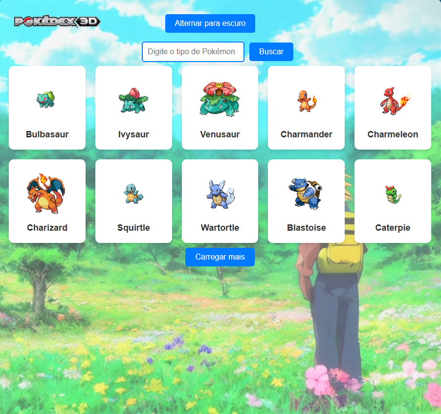
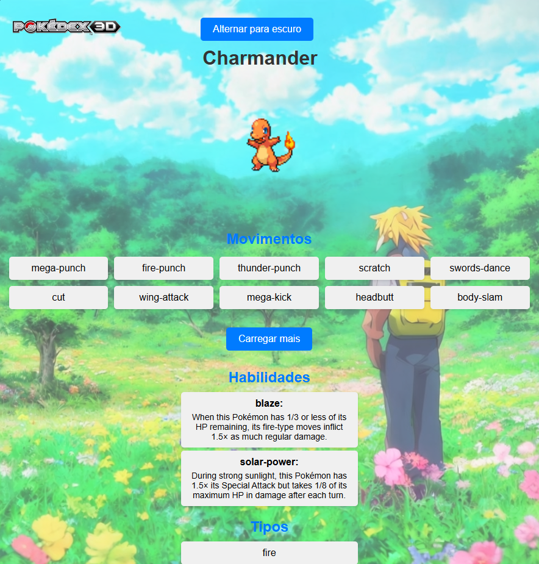

# Pokédex App

Aplicação desenvolvida como parte do desafio proposto no curso DevQuest, utilizando React com Vite para entregar uma experiência interativa de visualização de Pokémons.

## 🚀 Propósito da Aplicação

A Pokédex App tem como objetivo fornecer uma interface simples e interativa para listar, visualizar detalhes e pesquisar por Pokémons, utilizando dados da PokéAPI.

## 🧩 Funcionalidades

- Listagem de Pokémons com paginação;
- Visualização de detalhes individuais dos Pokémons;
- Sistema de pesquisa por tipo de Pokémons;
- Interface responsiva e temática inspirada no universo Pokémon.

## 🛠️ Ferramentas Utilizadas

- **React + Vite**: Por oferecerem uma estrutura moderna e performance otimizada durante o desenvolvimento.
- **React Router**: Para navegação entre páginas sem recarregamento da aplicação.
- **Styled-components**: Para estilização com escopo de componentes e temas dinâmicos.
- **PokéAPI**: API gratuita com dados completos dos Pokémons.

## 📌 Decisões Adotadas

- **Vite** foi escolhido pela sua velocidade no desenvolvimento e facilidade de integração com React.
- A estrutura de pastas foi pensada para separar componentes, estilos e páginas, facilitando a manutenção.
- Utilização de `HashRouter` para compatibilidade com o GitHub Pages.
- Imagens locais foram otimizadas para carregamento rápido.

## 📸 Imagens da Aplicação

Abaixo estão algumas capturas de tela demonstrando a interface e funcionalidades da aplicação:

| Página Inicial | Detalhes do Pokémon |
|----------------|---------------------|
|  |  |

## 🧪 Como Rodar Localmente

1. Clone este repositório:

```bash
git clone https://github.com/Vanderlei94/pokedex-app.git
```

2. Acesse a pasta do projeto:

```bash
cd pokedex-app
```

3. Instale as dependências:

```bash
npm install
```

4. Rode o projeto localmente:

```bash
npm run dev
```

5. Acesse no navegador:

```
http://localhost:5173
```

---

Desenvolvido com 💙 por Vanderlei durante o curso DevQuest.
